### Sync package overview

This document explains how the sync package works end-to-end, mapping responsibilities to files and data structures, and outlining the request/response flow, block queues, peer handling, and reputation management. It also describes planned improvements for deduplication and adaptive request sizing.

## Scope and entry points
- `service/syncing_service.rs`: Async handle used by other subsystems (consensus, RPC) to interact with syncing. Exposes status and events, forwards commands to the engine.
- `engine.rs` (SyncingEngine): Orchestrator. Owns peers, network handles, strategy, import queue, metrics, pending responses. Runs the main loop and applies strategy actions.
- Strategies (`strategy/`): Implement sync logic. The engine delegates all policy to the selected strategy.
  - `strategy/chain_sync.rs`: Full/light block sync (main block downloader, gap sync, fork sync, justifications).
  - `strategy/warp.rs`: Grandpa warp bootstrap (proofs, target block, then finish).
  - `strategy/state.rs` + `strategy/state_sync.rs`: Direct state download and import.
- Request handlers (serve incoming remote requests):
  - `block_request_handler.rs`, `state_request_handler.rs`, `warp_request_handler.rs`.
- Block queue:
  - `blocks.rs` (`BlockCollection`): Ranges to download, ready ranges, peer in-flight tracking.
- Types and public API:
  - `types.rs`, `lib.rs`.

## High-level flow
1) Peer connections and announces
   - Network opens a notifications substream (`NotificationStreamOpened`). The engine validates the handshake (`validate_connection`) and registers the peer in `peers: HashMap<PeerId, Peer>`.
   - Full peers are forwarded to the active strategy via `strategy.add_peer(peer_id, best_hash, best_number)`.
   - Block announces are validated asynchronously; on success the engine calls `strategy.on_validated_block_announce(...)` and may update the peer's best info in the engine.

2) Strategy produces actions
   - On every loop tick and on events (new peers, announces, finalized blocks, import results), the engine calls `strategy.actions(&network_service)`.
   - Strategies return a list of `SyncingAction` items:
     - `StartRequest { peer_id, key, request, remove_obsolete }` for block/state/warp requests
     - `CancelRequest`, `DropPeer(BadPeer)`, `ImportBlocks { .. }`, `ImportJustifications { .. }`, `Finished`

3) Engine executes actions and handles responses
   - Requests are registered in `pending_responses` keyed by `(PeerId, StrategyKey)`; obsolete responses with the same key can be dropped when a new request is started.
   - Incoming request results are polled by `PendingResponses`; the engine routes successful responses back to the strategy via `on_generic_response(..)`.
   - Network-level failures (timeouts, unsupported protocol, not connected, etc.) are handled in the engine (`process_response_event`), which reports/disconnects the peer and clears in-flight state.

4) Import path
   - Strategies enqueue blocks via `SyncingAction::ImportBlocks`. The engine forwards to the import queue (`ImportQueueService`).
   - When the import queue reports `blocks_processed`, the engine calls `strategy.on_blocks_processed(..)` to let the strategy update internal state (`queue_blocks`, `BlockCollection`, `gap_sync`, etc.).

## Where key state is kept
- Peers (all connected):
  - Engine: `peers: HashMap<PeerId, Peer>` with `ExtendedPeerInfo` (roles, best hash/number) and per-peer `known_blocks` (LRU) for re-announces.
  - Only full peers are visible to block and state sync strategies.

- Which blocks to fetch and from whom:
  - Strategy: `ChainSync` decides requests in `block_requests()` using:
    - `BlockCollection` to compute `needed_blocks(..)` ranges, track in-flight per-peer ranges, produce `ready_blocks(..)`.
    - `queue_blocks: HashSet<Hash>` to avoid re-queueing/duplicate imports.
    - Peer view: `PeerSync` (best/common numbers, current `PeerSyncState`) to choose ascending/descending, ancestry search, fork targets, gap sync.
    - Download limits: `max_parallel_downloads`, `max_blocks_per_request`, max-ahead window.

- Finding new peers:
  - Engine reacts to network events and validates/accepts peers; then invokes `strategy.add_peer(..)` for full peers.

- Incoming request handling (serving others):
  - `block_request_handler.rs` and `state_request_handler.rs` decode requests, read data from the client, and send `OutgoingResponse` with optional `reputation_changes`.
  - Both maintain `seen_requests: LruMap<SeenRequestsKey, SeenRequestsValue>` to penalize repeated identical queries.

## Request pipeline (outbound)
- Block requests: strategies use a `BlockDownloader` (client side of the block relay protocol) to send protobuf-encoded block requests over the request/response protocol.
- State requests: strategies directly encode `StateRequest` and send over the configured state protocol.
- Warp proofs: strategies send `WarpProofRequest` over the warp protocol; the engine routes the response back.

## Deduplication and limits
- In-flight dedupe per strategy: `PendingResponses` stores a single response stream per `(PeerId, StrategyKey)`. When `remove_obsolete` is true (block requests), obsolete streams are removed before inserting a new one.
- Block-level dedupe: `ChainSync.queue_blocks` ensures already queued/importing blocks are not queued again.
- Range-level coordination: `BlockCollection` limits `max_parallel_downloads` on a contiguous range and avoids scheduling the same start range to peers whose `common_number` is already past the start.

## Reputation/drop logic
- Strategies can emit `DropPeer(BadPeer)` with a specific `ReputationChange` (e.g., bad block, bad message, incomplete header).
- Engine maps network-level errors to penalties (`rep::TIMEOUT`, `rep::BAD_PROTOCOL`, `rep::REFUSED`) and disconnects.
- Fork/justification/state paths also apply appropriate penalties when responses are invalid or missing requested parts.

## Major syncing
- Reported via `SyncingService::is_major_syncing()` and Prometheus gauge. Internally:
  - `ChainSync.status()` sets state to `Downloading` or `Importing` when the target best (median of peers) is more than `MAJOR_SYNC_BLOCKS` (=5) ahead of our best; otherwise `Idle`.
  - The engine updates an atomic `is_major_syncing` each loop from `strategy.is_major_syncing()`.

## Important constants (selected)
- Outbound block response limits: `block_request_handler.rs`
  - `MAX_BLOCKS_IN_RESPONSE = 128`
  - `MAX_BODY_BYTES = 8 * 1024 * 1024` (8 MiB cap per response payload)
- Network loop tick: `TICK_TIMEOUT ≈ 1100ms`
- ChainSync heuristics:
  - `MAJOR_SYNC_BLOCKS = 5`
  - `MAX_IMPORTING_BLOCKS = 2048`
  - `MAX_DOWNLOAD_AHEAD = 2048`, `MAX_BLOCKS_TO_LOOK_BACKWARDS = 1024`

## Diagram

```mermaid
flowchart TD
  subgraph "Network"
    NS["NotificationService (block-announces)"]
    RR["Request/Response (block/state/warp)"]
    PS["PeerStore"]
  end

  subgraph "SyncingEngine"
    SE["SyncingEngine\nclient/network/sync/src/engine.rs"]
    PR["PendingResponses\n(polls in-flight requests)"]
    EV["Event Streams (SyncEvent)"]
    Peers["Peers: HashMap<PeerId, Peer)\n(best_hash, best_number, known_blocks)"]
  end

  subgraph "Strategies"
    CS["ChainSync\n(strategy/chain_sync.rs)"]
    WS["WarpSync\n(strategy/warp.rs)"]
    SS["StateStrategy\n(strategy/state.rs)"]
  end

  subgraph "Queues / Collections"
    BC["BlockCollection\n(needed_blocks, ready_blocks)"]
    QB["queue_blocks: HashSet<Hash>\n(best_queued_number/hash)"]
  end

  subgraph "Servers (incoming requests)"
    BRH["BlockRequestHandler\n(block_request_handler.rs)\nseen_requests: LruMap"]
    SRH["StateRequestHandler\n(state_request_handler.rs)\nseen_requests: LruMap"]
  end

  IQ["Import Queue\n(ImportQueueService)"]
  CL["Client (Header/Block/Proof)"]

  NS -->|"NotificationStreamOpened"| SE
  SE -->|"validate_connection + on_sync_peer_connected"| Peers
  Peers -->|"full peers only"| CS
  Peers --> WS
  Peers --> SS
  NS -->|"NotificationReceived: BlockAnnounce"| SE
  SE -->|"BlockAnnounceValidator"| SE
  SE -->|"on_validated_block_announce"| CS
  CS -->|"maybe update peer best, add fork targets"| SE

  CS -->|"actions(): StartRequest/Cancel/Import/DropPeer/Finished"| SE
  WS -->|"actions()"| SE
  SS -->|"actions()"| SE

  SE -->|"StartRequest (Block/State/Warp)"| PR
  PR -->|"ResponseEvent"| SE
  SE -->|"on_generic_response(..)"| CS
  SE -->|"on_generic_response(..)"| WS
  SS -->|"state_response path"| SE

  SE -->|"download via BlockDownloader"| RR
  RR -->|"responses"| PR

  CS -->|"ImportBlocks"| SE
  WS -->|"ImportBlocks (state complete)"| SE
  SS -->|"ImportBlocks (state complete)"| SE
  SE --> IQ
  IQ -->|"blocks_processed()"| SE
  SE -->|"strategy.on_blocks_processed(..)"| CS

  CS --> BC
  CS --> QB
  CS -->|"client.info(), headers, bodies"| CL
  WS -->|"headers for target, status"| CL
  SS -->|"verify range proofs (optional)"| CL

  RR --> BRH
  RR --> SRH
  BRH -->|"OutgoingResponse + reputation_changes"| RR
  SRH -->|"OutgoingResponse + reputation_changes"| RR

  SE -->|"SyncingAction::DropPeer"| RR
  SE -->|"report_peer(..) / disconnect_peer(..)"| RR
```

## Answers to common questions
- Where do we keep which blocks to fetch and which peers to contact?
  - `ChainSync` keeps per-peer state (`PeerSync`) and decides requests in `block_requests()`. It delegates planning to `BlockCollection` and avoids duplicates via `queue_blocks`.
- Where do we find new peers?
  - The engine listens to network notification events, validates handshakes, and registers peers. Full peers are handed to `strategy.add_peer(..)`.
- Where are duplicates avoided?
  - In-flight per `(PeerId, StrategyKey)` via `PendingResponses`; per-block in `queue_blocks`; per-range in `BlockCollection` (limits & gaps). Incoming request handlers also LRU-track repeated identical requests for reputation changes.

## Planned improvements

These are design changes to implement next. They intentionally build on the current architecture and reuse existing components where possible.

- Use current major sync detection as-is
  - Keep `is_major_syncing()` signal from `ChainSync`/engine for gating behavior across the system.

- Never repeat the same request to the same peer
  - Extend `ChainSync` with per-peer request history keyed by an immutable request signature (from, direction, attributes, max/window) so `block_requests()` avoids repeating with the same `(peer, signature)`.
  - Record history when enqueuing `StartRequest`. Optionally clear history for a peer on disconnect.
  - Consider annotating `BlockCollection` ranges with the set of peers already attempted for stronger dedupe at the range layer.

- Gate peer drops behind major sync with a timeout budget
  - Add a configurable `max_timeouts_before_drop` (default: 20).
  - In `engine::process_response_event`, count per-peer network failures; during major sync, do not `disconnect_peer` or emit `DropPeer` until the threshold is exceeded. Outside major sync, keep current behavior.
  - Expose counters to strategies if we want per-strategy decisions; otherwise centralize in the engine for network failures and keep strategy-reported `DropPeer` for data-validity issues.

- Adaptive request sizing (handle large bodies on bad links)
  - Keep per-peer success/failure stats and estimate a failure rate per request size window.
  - Heuristic: if a peer with a good recent success rate starts failing repeatedly on a given range, assume large payload and downsize `max` for the next attempts against that peer; prefer splitting ranges rather than penalizing the peer.
  - Start conservative during major sync (smaller `max_blocks_per_request`), and grow as success rate improves.

### Concrete code touch points
- `strategy/chain_sync.rs`:
  - Add per-peer request history and per-peer request outcome stats.
  - In `block_requests()`, consult history to avoid repeats; scale `max` adaptively based on peer stats and major sync flag.
  - In `on_block_response` success path, update peer success stats; when `validate_blocks` is OK, increase confidence.
  - Optionally track a small sliding window to compute fail% per peer.

- `engine.rs`:
  - In `process_response_event`, when a `RequestFailure` occurs, increment per-peer failure counters. If `is_major_syncing` is true and failures < `max_timeouts_before_drop`, avoid disconnect/penalty; else keep existing penalties.
  - Provide a way to pass failure signals to `ChainSync` (optional) if adaptive logic should live entirely in the strategy.

- Configuration:
  - Add `max_timeouts_before_drop` to sync configuration (engine or strategy config). Default to 20.

## Validation notes
This document is cross-checked against:
- `engine.rs`: peer lifecycle, `process_response_event`, action execution, event loop, metrics.
- `strategy/chain_sync.rs`: peers, queues, request planning, imports, justifications, warp/gap/state handoffs.
- `blocks.rs`: range planning logic and dedupe.
- `block_request_handler.rs`, `state_request_handler.rs`, `warp_request_handler.rs`: inbound server behavior and spam protection.
- `types.rs`, `service/syncing_service.rs`: status, events, and major sync oracle.

